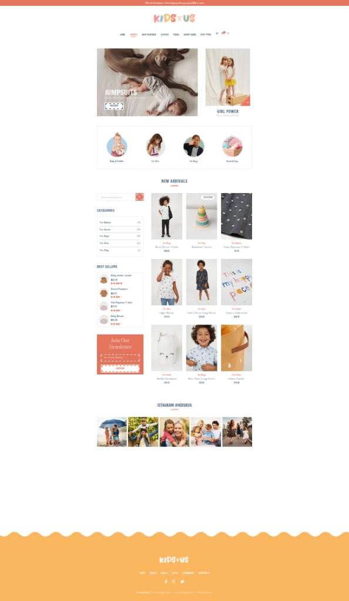

# BB Digital technical exercise.

## Table of contents

- [Overview](#overview)
  - [The challenge](#the-challenge)
  - [Screenshot](#screenshot)
  - [Performance](#perfermance)
  - [Links](#links)
- [My process](#my-process)
  - [Built with](#built-with)
  - [Usage](#usage)
- [Author](#author)
- [Acknowledgments](#acknowledgments)

## Overview

### The challenge

FRONTEND DEVELOPER EXERCISE:
Make a replica, in desktop version (non-responsive), of the following two pages:

a) Page no. 1: Search Results This page contains a list of results from an article search. The functionalities that you must reproduce are the following:
- When you first arrive at the page, articles are randomly displayed from the categories: for girls, for boys, for babies, for home, for play.
- By pressing any of these categories, either by clicking on the links as circles or to the left in the category box, all items should be displayed.
- Items out of stock cannot be added to the shopping cart (GIF)
- In-stock items can be added to cart. (GIFs)
- Moving the mouse over the product displays another image of the same product in case it exists.
- Show the stars according to the evaluation of the product.
- Clicking on any product sends the user to a page that we will call product page (PDP).

b) Page no. 2: Product Page This page contains the characteristics of a particular product. The functionalities that you must reproduce are the following:

- The name of the product appears as the title of the page; as subtitle appears HOME: [category]: [product title]. The category is a link that should send you to the page that you developed in part a) with the selected category.
- Each product must have:
  - Name or title
  - Price.
  - Quantity in stock.
  - Category
  - Tags
  - Description. The description can be the same for all products(lorem ipsum).
  - Additional information.
  - Valuation.
  - Sku (unique identifier).
  - Associated images.
- When you move the mouse over the product image, an image appears next to it augmented.
- You can view the different images of the product by clicking on them.
- You can view the description and additional information of the product.
- The images of related products must be four (4) maximum, belonging to the same category.

### Screenshot

### Performance

### Links

- Solution URL: [Solution URL](https://github.com/adrianburgoscolas/kidsrus_ecommerce)
- Live Site URL: [Live Site](https://kidsrus-ecommerce-swqx.vercel.app/)

## My process

### Built with

- [Next.js](https://nextjs.org/) - React framework
- Semantic HTML5 markup
- TailwindCSS custom properties

### Usage

#### Local

- Git clone the project `git clone https://github.com/adrianburgoscolas/kidsrus_ecommerce`
- Go to the project directory `cd kidsrus_ecommerce`
- Install dependencies `npm install`
- Build the project `npm run build`
- Start production build `npm start`

#### Live

- Go to live url: [Live Site](https://kidsrus-ecommerce-swqx.vercel.app/)

## Author

- Website - [Adrian Burgos: Portfolio](https://adrianburgoscolas.github.io/portfolio/)
- GitHub - [https://github.com/adrianburgoscolas](https://github.com/adrianburgoscolas)
- LinkedIn - [Adrian Burgos Full Stack Web Developer](https://www.linkedin.com/in/adrian-burgos-1776a6144/)

## Acknowledgments
- To mock the page data an api was implemted at `BASE_URL/api/db`, it returns an json with products info.
- To simulate a Data Base behavior some fields are randomly filled at request time every 10min.
